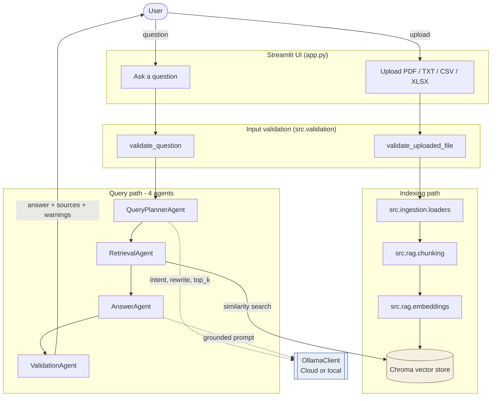

# Architecture

Two flows run through this app: an **indexing path** that turns uploaded files into a searchable vector store, and a **query path** that uses four cooperating agents to turn a question into a grounded answer. The diagram below shows both, with dashed arrows marking the LLM calls that fall back to deterministic behavior when the model is not configured or returns junk.

## Diagram



Solid arrows always run. Dashed arrows are LLM calls and degrade to a deterministic path on any failure.

## Module map

| Folder / file | Responsibility |
|---|---|
| `app.py` | Streamlit UI: upload form, question form, answer panel, source displays. |
| `src/ingestion/loaders.py` | Reads PDF, TXT, CSV, and Excel into a normalized `SourceDocument` shape with per-source metadata. |
| `src/rag/chunking.py` | Splits long documents into overlapping `TextChunk`s with stable ids. |
| `src/rag/embeddings.py` | Two providers: `local-hash` (fast, no download) and SentenceTransformers (semantic). Both implement the same interface. |
| `src/retrieval/vector_store.py` | Persistent Chroma collection. Handles upsert, similarity search, metadata sanitization, and telemetry silencing. |
| `src/agents/` | Four agents: `QueryPlannerAgent`, `RetrievalAgent`, `AnswerAgent`, `ValidationAgent`. |
| `src/llm/ollama.py` | Thin HTTP client for the Ollama chat API. One implementation covers Ollama Cloud and any local Ollama-compatible endpoint. |
| `src/validation.py` | Input checks for uploads and questions, including a basic prompt-injection sniff. |
| `src/config.py` | Loads runtime settings from environment variables and `.env`. |
| `src/models.py` | Frozen dataclasses shared between modules. |
| `src/rag/workflow.py` | The orchestrator that wires everything together. |

## Indexing path

Each upload that arrives from the **Index documents** click runs through these stages:

1. **Validation.** Extension, file size, non-emptiness are checked. Failures appear as per-file error messages; the rest of the batch still indexes.
2. **Parsing.** The loader that matches the extension extracts text and keeps locating metadata: page numbers for PDFs, sheet names and row ranges for Excel, row ranges for CSV. That metadata shows up later next to each cited passage.
3. **Chunking.** Long documents are split into overlapping chunks with stable ids. Overlap is what lets a fact that straddles two pages still get retrieved from at least one chunk.
4. **Embedding.** Each chunk is turned into a vector by the configured provider. `local-hash` returns a fast deterministic vector and needs no model download; switching `EMBEDDING_MODEL` to a sentence-transformer gives real semantic embeddings at the cost of the first-time model download.
5. **Storage.** Chunks, embeddings, and metadata are upserted into a local persistent Chroma collection. The collection is reset by default on each indexing run so old chunks from a previous demo do not linger.

## Query path

A question is handed to four agents in a fixed order. Two of them call the LLM; the other two are deterministic.

### QueryPlannerAgent (uses LLM, with fallback)

The question is cleaned and checked for non-emptiness. If the LLM is configured, the planner asks for a single JSON object:

```json
{
  "intent": "factual | summarize | compare | list",
  "search_query": "short retrieval-friendly rewrite, 3-15 words",
  "top_k": 3-8
}
```

The rewrite can add synonyms that enterprise documents tend to use (e.g. "risk, blocker, issue"). The `top_k` is adaptive: 3-4 for narrow factual or list questions, 5-8 for summaries and comparisons. Any failure — timeout, non-JSON output, unknown intent, blank rewrite, out-of-range `top_k` — silently falls back to the deterministic plan with the configured default. The demo never breaks on a planner glitch.

### RetrievalAgent (deterministic)

Calls `ChromaVectorStore.query(plan.search_query, plan.top_k)` and returns a list of `RetrievedChunk`s, each carrying its original metadata and a relevance score derived from the cosine distance. No LLM involvement.

### AnswerAgent (uses LLM, with fallback)

Builds a grounded prompt that includes:

- The **user's original question** — not the planner's rewrite. The answer should speak in the user's terms.
- The retrieved chunks numbered as `[Source 1]`, `[Source 2]`, ..., each annotated with its source label and relevance score.

The system message asks the model to cite source numbers inline and to end every response with a parseable line:

```
Used sources: 1, 3
```

That trailing line is what makes the **Sources used** panel possible: it is stripped from the displayed answer and used to mark which chunks the model actually relied on. If the LLM is not configured, the agent returns a retrieval-only answer — the top three matching passages, formatted as a short list, with a warning that no LLM was involved.

### ValidationAgent (deterministic)

Inspects the answer and the retrieved chunks and appends warnings next to the answer when:

- No source context was retrieved.
- All retrieved sources are below `MIN_RELEVANCE_SCORE`.
- The answer text is empty.
- The LLM was not used at all.
- The LLM was used but never declared a `Used sources:` line.

The agent never rewrites the answer. Warnings ride alongside it so the user can decide how much to trust it.

## Data shapes

All of these are frozen dataclasses. Mutation happens only at the boundary between agents.

| Shape | Defined in | Carries |
|---|---|---|
| `SourceDocument` | `src/models.py` | Normalized text + metadata (`source_name`, `doc_type`, `page`, `sheet`, `row_range`). |
| `TextChunk` | `src/models.py` | Chunk id, text, metadata, `chunk_index`. |
| `RetrievedChunk` | `src/models.py` | Chunk + `relevance_score` + raw `distance`. |
| `QueryPlan` | `src/agents/query_planner.py` | `question`, `top_k`, `intent`, `search_query`. |
| `AnswerDraft` | `src/agents/answer_agent.py` | answer text, `used_llm`, `used_source_indices`, `source_citation_missing`, draft warnings. |
| `ValidationReport` | `src/agents/validation_agent.py` | Final warnings list. |
| `QueryResult` | `src/models.py` | What the UI renders: `question`, `answer`, `sources`, `warnings`, `used_llm`, `used_source_indices`. |

## Fallbacks and graceful degradation

The app is designed to keep working when external dependencies misbehave:

- **No LLM configured** — planner returns the deterministic plan; answer agent returns a retrieval-only answer with the top passages; UI shows a warning.
- **Planner LLM call fails or returns garbage** — same deterministic fallback, no user-visible error.
- **Answer LLM call fails** — the error is surfaced in the Streamlit UI so the reviewer can see what went wrong.
- **No embedding model downloaded** — `local-hash` is the default and needs nothing on disk beyond Python.
- **Chroma telemetry errors** — telemetry is disabled at import time so the noisy `posthog` warnings never reach the log.
- **Scanned PDF with no text layer** — rejected at parse time with a clear message; the rest of the batch still indexes.
- **CSV or Excel with no readable rows** — rejected per-file with a clear message.

## Why this design

- **Four agents, hand-rolled.** No LangChain, LlamaIndex, or CrewAI. Each agent is a small Python class with one job, which keeps the pipeline trivially testable and easy to walk through during a demo.
- **Two LLM calls per question.** The planner adds an extra round trip but earns it back in two places: better recall on vaguely worded questions, and an adaptive `top_k` that gives summarize/compare questions more context without bloating narrow factual ones.
- **The original question reaches the answer agent.** The planner's rewrite is used only to fetch chunks; the answer speaks to the question that was actually typed.
- **Retrieved vs used kept distinct.** The `Used sources:` contract makes it possible to show two separate panels instead of pretending the model relied on every retrieved chunk.
- **Local-first defaults.** `local-hash` embeddings, a local Chroma store, and the retrieval-only fallback let the app start up and produce something useful without any network call.

## Where to read each piece

| Topic | File |
|---|---|
| Loaders for the four file formats | `src/ingestion/loaders.py` |
| Chunking rules | `src/rag/chunking.py` |
| Embedding providers | `src/rag/embeddings.py` |
| Chroma wrapper | `src/retrieval/vector_store.py` |
| Planner prompt and JSON parsing | `src/agents/query_planner.py` |
| Grounded prompt and `Used sources:` parser | `src/agents/answer_agent.py` |
| Post-answer warnings | `src/agents/validation_agent.py` |
| Ollama HTTP client | `src/llm/ollama.py` |
| Input validation | `src/validation.py` |
| End-to-end workflow | `src/rag/workflow.py` |
